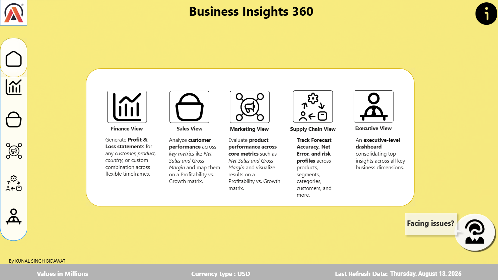
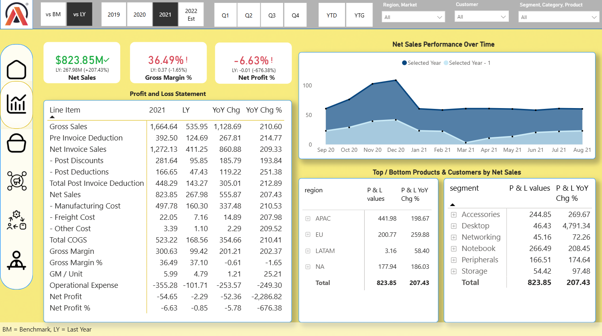
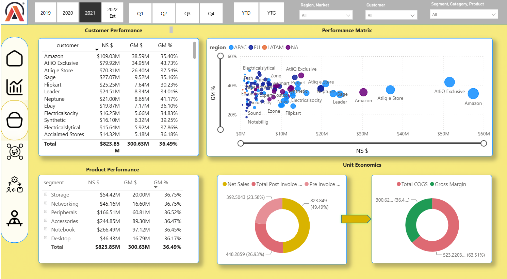
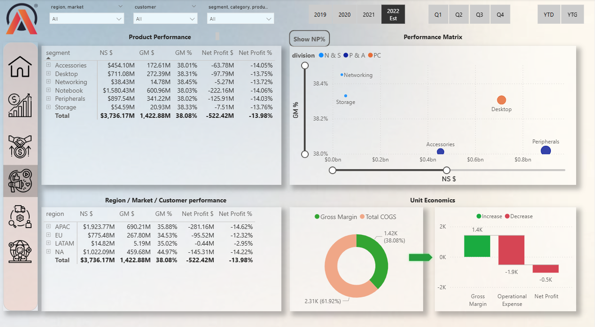
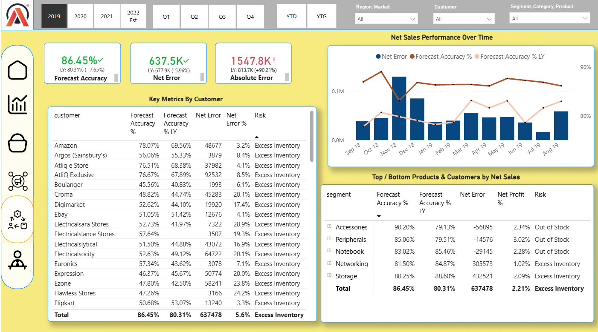
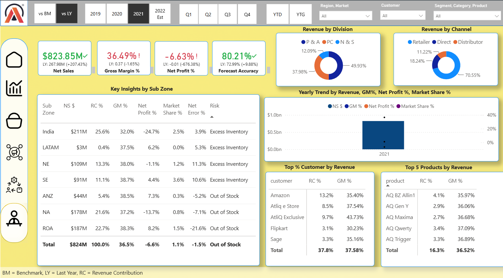

# AtliQ Hardware | Business Insights 360

## Overview

Business Insights 360 is an end-to-end Power BI analytics project built for AtliQ Hardware, a consumer electronics company operating across multiple markets and sales channels.

The objective was to consolidate data from different business functions into a single reporting solution covering Finance, Sales, Marketing, Supply Chain and Executive reporting.

The report allows users to analyse business performance across customers, products, regions and time periods, while also comparing actual performance against benchmarks and previous periods.

---

## Business Context

AtliQ Hardware operates through multiple sales channels:

- **Direct:** AtliQ's own e-commerce and brick-and-mortar stores
- **Retailer:** Third-party retailers and stores
- **Distributor:** Distribution partners across different markets

As the business operates across multiple markets, customers and product segments, analysing performance through disconnected reports makes it difficult to get a complete view of the business.

This project brings key financial, commercial and operational metrics into a single Power BI solution.

---

## Project Scope

The report is divided into five business functions:

| Function | Focus |
|---|---|
| Finance | Profit & Loss analysis and financial performance |
| Sales | Customer, product and regional performance |
| Marketing | Product performance and profitability analysis |
| Supply Chain | Forecast accuracy, net error and inventory risk |
| Executive | Consolidated view of overall business performance |

---

# Key Business Snapshot

Based on the latest available reporting period (2022 Estimate):

| KPI | Value |
|---|---:|
| Net Sales | **$3.74 Billion** |
| Gross Margin | **38.08%** |
| Net Profit % | **-13.98%** |
| Gross Margin Value | **$1.42 Billion** |
| Net Profit | **-$522.42 Million** |
| Forecast Accuracy | **81.17%** |
| Absolute Forecast Error | **6.90 Million** |

The overall picture shows a business generating strong revenue and maintaining a gross margin of approximately 38%, while profitability remains negative due to operational expenses and other costs. Supply chain performance also highlights opportunities to improve forecast accuracy and reduce inventory-related risks.

---

# Dashboard Preview

## Home View

The home page acts as the central navigation point for the report. Users can move between Finance, Sales, Marketing, Supply Chain and Executive views.

---

# Finance Analysis

The Finance view focuses on the company's Profit & Loss statement and year-over-year performance.

### Key Metrics

- Net Sales: **$3.74 Billion**
- Gross Margin: **38.08%**
- Net Profit %: **-13.98%**
- Net Profit: approximately **-$522 Million**

The dashboard provides a detailed Profit & Loss statement with the ability to analyse changes against the previous year and benchmark values.

It also breaks down financial performance across regions and product segments.

### Key observations

- Despite generating nearly **$3.74B in Net Sales**, the business reports a negative Net Profit margin.
- Gross Margin remains relatively healthy at **38.08%**, suggesting that profitability challenges are likely driven further down the P&L.
- The report allows users to trace performance from Gross Sales through deductions, manufacturing costs, freight costs and operational expenses.

---

# Sales Analysis

The Sales view provides detailed analysis of customer and regional performance.

### Top Customers by Net Sales

| Customer | Net Sales | Gross Margin % |
|---|---:|---:|
| Amazon | $496.88M | 36.78% |
| AtliQ Exclusive | $361.21M | 46.01% |
| AtliQ eStore | $304.10M | 36.88% |
| Flipkart | $138.49M | 42.14% |
| Sage | $127.85M | 31.53% |

### Regional Performance

The report also compares customer performance across major markets including APAC, EU, LATAM and North America.

### Key observations

- **Amazon** is the largest customer by revenue, contributing approximately **$497M** in Net Sales.
- **AtliQ Exclusive** generates strong revenue while maintaining a higher Gross Margin of **46.01%**.
- The performance matrix makes it easier to identify customers based on both revenue contribution and profitability instead of looking at sales in isolation.

---

# Marketing and Product Analysis

The Marketing view focuses on product performance, profitability and unit economics.

### Product Performance

| Product Segment | Net Sales | Gross Margin % |
|---|---:|---:|
| Peripherals | $897.54M | 38.03% |
| Notebook | $1.58B | 38.03% |
| Desktop | $711.08M | 38.31% |
| Accessories | $454.10M | 38.45% |
| Storage | $54.59M | 38.33% |
| Networking | $38.43M | 38.45% |

### Key observations

- **Notebook products** are the largest revenue-generating segment at approximately **$1.58B**.
- Gross Margin percentages remain relatively consistent across product categories, at around **38%**.
- The performance matrix allows comparison of divisions based on both Net Sales and Gross Margin.
- Unit economics visuals help analyse the relationship between revenue, cost of goods sold, gross margin and profitability.

---

# Supply Chain Analysis

The Supply Chain view focuses on forecast accuracy and operational risk.

### Key Metrics

| Metric | Value |
|---|---:|
| Forecast Accuracy | **81.17%** |
| Forecast Accuracy (Last Year) | **80.21%** |
| Net Error | **-3472.7K** |
| Absolute Error | **6899K** |

The dashboard analyses forecast performance at customer and product segment levels.

### Risk Identification

The report identifies operational risks including:

- Out of Stock
- Excess Inventory

### Key observations

- Forecast Accuracy improved slightly from **80.21% to 81.17%**.
- The negative Net Error indicates a gap between forecasted and actual demand.
- Several product segments and customers are flagged for either **Out of Stock** or **Excess Inventory**, highlighting the importance of improving demand planning.

---

# Executive View

The Executive dashboard provides a consolidated view of business performance.

It combines metrics from Finance, Sales and Supply Chain into a single page designed for high-level decision making.

The view includes:

- Net Sales
- Gross Margin
- Net Profit
- Forecast Accuracy
- Revenue by division
- Revenue by sales channel
- Yearly performance trends
- Regional performance
- Top customers
- Top products

### Revenue by Channel

The report analyses revenue contribution across:

- Retail
- Direct
- Distributor

### Key observations

- The Executive view enables users to monitor overall business health without navigating through individual departmental reports.
- Revenue trends, market performance and profitability can be analysed together to identify areas requiring management attention.
- The dashboard provides drill-down capability into customers, products, regions and time periods.

---

# Tools and Techniques Used

- **Power BI**
- **Power Query**
- **DAX**
- **Data Modeling**
- **ETL and Data Transformation**
- **Data Visualization**
- **Business Performance Analysis**

---

# Skills Demonstrated

### Data Preparation
- Data cleaning and transformation using Power Query
- Preparing data for reporting and analysis
- Working with multiple business datasets

### Data Modeling
- Building relationships between fact and dimension tables
- Creating a structured data model for cross-functional reporting

### DAX and Business Metrics
- Creating measures for financial and operational KPIs
- Year-over-Year comparisons
- Benchmark analysis
- Gross Margin and Net Profit calculations
- Forecast Accuracy and Net Error metrics

### Dashboard Design
- Designing reports for different business functions
- Creating drill-down and filtering capabilities
- Building KPI cards and performance matrices
- Presenting detailed and executive-level insights

---

# Repository Contents

| File | Description |
|---|---|
| `HomeView.png` | Report navigation page |
| `FinanceView.png` | Finance and P&L analysis |
| `SalesView.png` | Customer and sales performance |
| `MarketingView.png` | Product and marketing analysis |
| `SupplyChainView.png` | Forecast and supply chain analysis |
| `ExecutiveView.png` | Consolidated executive dashboard |

---

## Author

**Kunal**

Aspiring Data Analyst with an interest in Business Intelligence, Power BI and data-driven decision making.

**Skills:** Power BI | SQL | Excel | Data Analysis | Business Intelligence
